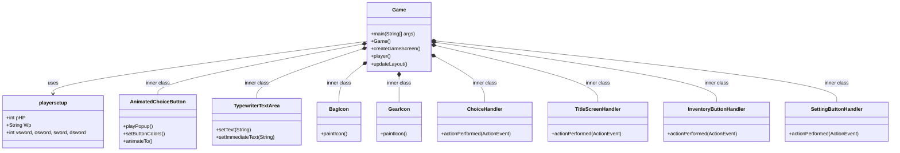
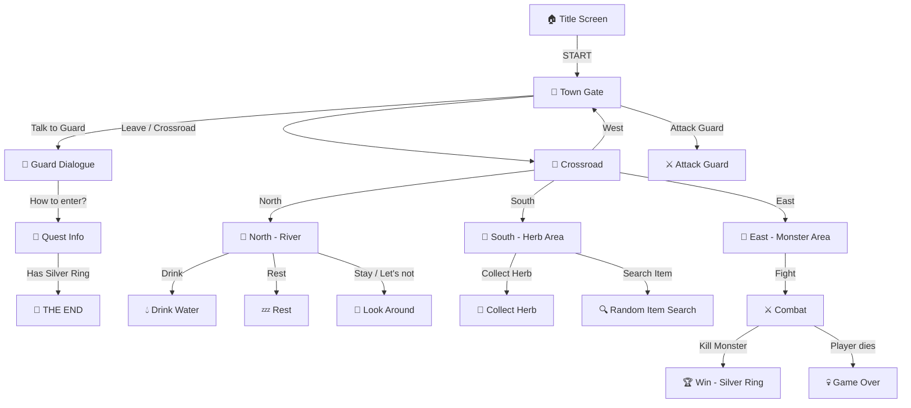
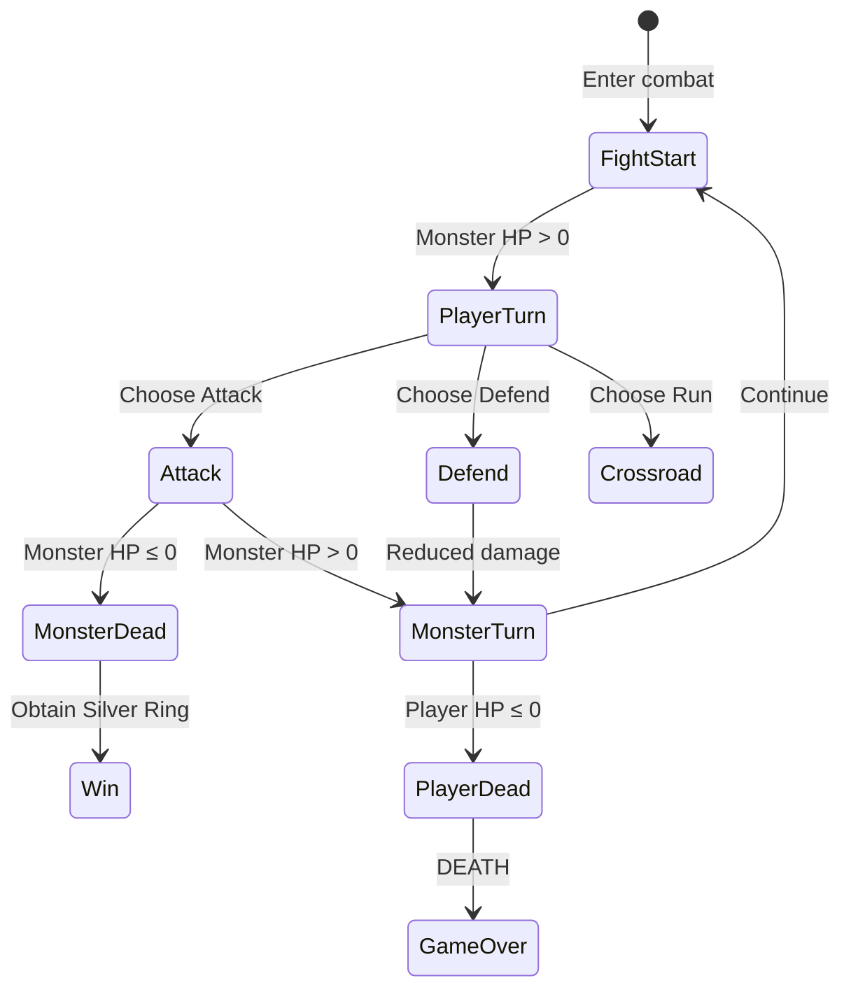
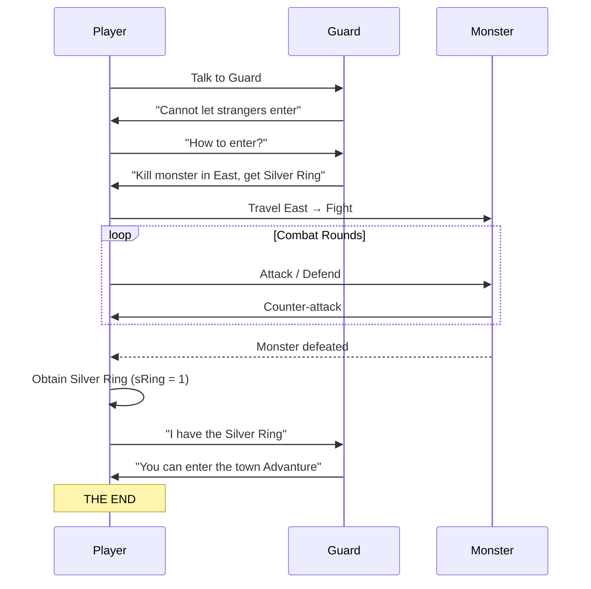

# AdvantureGUI — Product Requirements Document (PRD)

> **Version:** 1.0  
> **Date:** April 27, 2026  
> **Author:** Auto-generated from source code analysis  
> **Status:** Current State Documentation

---

## 1. Product Overview

### 1.1 Summary

**AdvantureGUI** is a single-player, text-adventure-style game built with **Java Swing**. The player explores a fantasy world through narrative text and context-sensitive choice buttons, collecting items, fighting monsters, and completing a main quest to gain entry into a guarded town.

### 1.2 Vision

A lightweight, nostalgia-driven adventure game that marries classic text-adventure storytelling with a modern GUI interface — featuring animated buttons, typewriter text effects, and a responsive layout.

### 1.3 Origin

> *"At the beginning this project was 100% human-made with purpose to learning Java, since there are AI-tools, I'm start polish and change some algorithm with AI."*

### 1.4 Target Audience

| Segment | Description |
|---|---|
| Primary | Java learners looking for a reference project |
| Secondary | Casual gamers who enjoy text-adventure / RPG-lite experiences |
| Tertiary | Indie game enthusiasts interested in Swing-based game design |

---

## 2. Game Architecture

### 2.1 Technology Stack

| Layer | Technology |
|---|---|
| Language | Java (with module system — `module-info.java`) |
| UI Framework | Java Swing (`JFrame`, `JPanel`, `JButton`, `JTextArea`, `JLabel`) |
| Build System | Apache Ant (`build.xml`) |
| IDE Support | IntelliJ IDEA (`.idea/`), Eclipse (`.classpath`, `.project`) |

### 2.2 Project Structure

```
AdvantureGUI/
├── README.md
└── Advanture/
    ├── build.xml
    └── src/
        ├── module-info.java
        └── pack/
            ├── Game.java          # Main game logic, UI, and all inner classes (~1,494 lines)
            ├── playersetup.java   # Player data holder (HP, weapon, sword inventory)
            ├── choice.java        # Unused / commented-out stub
            ├── Respon.java        # Unused / commented-out responsive text prototype
            └── package-info.java  # Package descriptor
```

### 2.3 Class Diagram (Simplified)



---

## 3. Core Gameplay Mechanics

### 3.1 Main Objective

> **Talk to the town guard → Learn requirements → Kill a monster in the East → Obtain the Silver Ring → Return to the guard → Enter the town → THE END.**

### 3.2 Player Stats

| Stat | Initial Value | Notes |
|---|---|---|
| **HP** | 15 | Displayed in top-left HUD. Can increase/decrease through gameplay |
| **Weapon** | Knife | Default weapon. Can be upgraded via random item search in South |

### 3.3 Exploration System

The game world is organized as a set of **interconnected locations** navigated through choice buttons:



#### Location Details

| Location | Position Key | Description | Available Actions |
|---|---|---|---|
| Town Gate | `tg` | Starting area with a guard | Talk to Guard, Attack Guard, Leave to Crossroad |
| Guard Talk | `talkGuard` | Dialogue with the guard | Ask how to enter, Go back, Go to Crossroad |
| Quest Info | `how` | Guard reveals quest requirements | Present Silver Ring (if owned), Go back, Crossroad |
| Attack Guard | `attg` | Player attacks the guard (always misses) | Apologize (takes 6 damage) |
| Crossroad | `crossRoad` | Hub connecting all areas | North, South, West (Town Gate), East |
| North | `north` | River area for healing | Drink water, Rest, Look around, Stay |
| South | `south` | Herb collection and item search area | Collect Herb, Search random item, Rest, Go back |
| East | `east` | Monster encounter zone | Fight, Rest, Run |
| Settings | `setting` | Menu screen | Status, Go back |
| Inventory | `inventory` | Item management screen | Go back, Eat Grass, Navigate `<` `>` |

### 3.4 Combat System

Combat occurs in the **East** area against a single monster type.

#### Combat Flow



#### Combat Stats

| Entity | HP | Damage Range |
|---|---|---|
| **Monster** | 25 (resets on new fight) | 0–7 (random) |
| **Monster (vs. Defend)** | — | 0–2 (reduced) |

#### Weapon Damage Ranges

| Weapon | Min Damage | Max Damage | Damage Formula |
|---|---|---|---|
| Knife (default) | 2 | 6 | `2 + random(5)` |
| Old Sword | 6 | 12 | `6 + random(7)` |
| Steel Sword | 10 | 18 | `10 + random(9)` |
| Dynian Sword | 18 | 32 | `18 + random(15)` |
| Void Nature Glass Sword | 30 | 55 | `30 + random(26)` |

### 3.5 Item System

#### 3.5.1 Weapon Drops (South — "Search random item")

Weapons are obtained via random search in the South area. Finding a weapon **auto-equips** it.

| Weapon | Drop Chance | Rarity Tier |
|---|---|---|
| Old Sword | 50% | Common |
| Steel Sword | 20% | Uncommon |
| Dynian Sword | 28% | Rare |
| Void Nature Glass Sword | 2% | Legendary |

> [!NOTE]
> The drop probability thresholds are: `< 0.02` → Void NG Sword, `< 0.30` → Dynian, `< 0.50` → Steel, `else` → Old Sword.

#### 3.5.2 Grass / Healing Items (South — "Collect Herb")

Grass items are consumable healing items collected in the South area.

| Grass Item | Drop Chance | Heal Amount | Grade |
|---|---|---|---|
| Nature Glass | 50% | +5 HP | Low-Grade |
| Rare Nature Glass | 20% | +15 HP | Medium-Grade |
| Super Rare Nature Glass | 28% | +30 HP | High-Grade |
| Absolute Nature Glass | 2% | +100% current HP | Highest-Grade |

> [!IMPORTANT]
> Each grass type is stored as a binary flag (0 or 1) — the player can hold **at most one** of each type at a time. Consuming a grass sets its flag back to 0.

### 3.6 Healing Sources

| Source | HP Restored | Location |
|---|---|---|
| Rest | +2 HP | North, South, East (via Rest option) |
| Drink River Water | +5 HP | North (text says +6 but code gives +5) |
| Nature Glass | +5 HP | Inventory (consumed) |
| Rare Nature Glass | +15 HP | Inventory (consumed) |
| Super Rare Nature Glass | +30 HP | Inventory (consumed) |
| Absolute Nature Glass | +100% current HP | Inventory (consumed) |

> [!WARNING]
> **Bug:** The drink action text displays "HP + 6" but the code adds only 5 HP (`pHP = pHP + 5`).

### 3.7 Inventory System

- Opened via the **Bag icon** button (right of choice panel) or through specific in-game flow
- Displays all collected grass items and weapons
- **Grass selection** uses `<` and `>` arrow buttons to cycle through available grass types
- **"Eat Grass"** consumes the currently selected grass item
- **Context preservation:** When opened via the bag icon shortcut, the game state (text, button labels, position) is saved and restored on return

---

## 4. UI/UX Specification

### 4.1 Screen Layout

```
┌──────────────────────────────────────────────┐
│ ⚙️  HP: 15    Weapon: Knife                  │  ← Player Panel (pPanel)
├──────────────────────────────────────────────┤
│                                              │
│   You are at the Gate of the Town.           │  ← Main Text Area (mTArea)
│   A Guard is standing in front of you.       │     - TypewriterTextArea
│                                              │     - Typewriter effect (9ms/char)
│   What do you do?                            │
│                                              │
├──────────────────────────────────────────────┤
│                                              │
│        ┌─────────────────────┐               │
│        │  Talk to the Guard  │               │
│        ├─────────────────────┤     ┌───┐     │
│        │  Attack the Guard   │     │ 🎒│     │  ← Bag Button (invButton)
│        ├─────────────────────┤     └───┘     │
│        │      Leave          │               │
│        ├─────────────────────┤               │
│        │                     │  ← Hidden     │  ← Choice Panel (cBPanel)
│        └─────────────────────┘               │     - 4x GridLayout
│                                              │
└──────────────────────────────────────────────┘
```

### 4.2 Visual Design

| Element | Specification |
|---|---|
| **Color Scheme** | Black background, white text (dark theme) |
| **Font Family** | Times New Roman |
| **Title Font Size** | Dynamic: `max(40, min(120, windowWidth / 11))` |
| **Body Font Size** | Dynamic: `max(16, min(36, windowWidth / 32))` |
| **Button Style** | Rounded rectangle, dark fill (`rgb(18,18,18)`), white border |
| **Button Hover** | Lighter fill + 4% scale-up animation (90ms) |
| **Button Exit** | Scale back to 100% (100ms) |
| **Popup Animation** | Buttons enter at 86% scale → animate to 100% (120ms) |
| **Text Effect** | Typewriter: characters appear one at a time at 9ms intervals |
| **Window Size** | 1000×680 default, **fully responsive** to resize |

### 4.3 Custom Components

| Component | Type | Description |
|---|---|---|
| `AnimatedChoiceButton` | `JButton` subclass | Custom-painted rounded buttons with scale animations, hover effects, and configurable colors |
| `TypewriterTextArea` | `JTextArea` subclass | Overrides `setText()` to display text character-by-character. Also provides `setImmediateText()` for instant display |
| `BagIcon` | `Icon` implementation | Procedurally drawn bag/backpack icon using Graphics2D |
| `GearIcon` | `Icon` implementation | Procedurally drawn gear/settings icon with 8 teeth using Graphics2D |

### 4.4 Button Visibility Rules

| Condition | Behavior |
|---|---|
| Button text is empty | Fully transparent (alpha = 0), disabled |
| Button text is `<` or `>` | Visible and enabled (navigation arrows) |
| Button text has content | Visible and enabled with standard styling |
| Game state is `death` or `end` | All choice buttons hidden and disabled |
| Silver Ring requirement not met | `c1` button semi-transparent (alpha = 128), disabled |

---

## 5. Game Flow — Win Condition



---

## 6. Game Flow — Lose Condition

| Death Trigger | Scenario |
|---|---|
| Monster combat | Player HP drops to ≤ 0 during monster attack phase |
| Guard attack | Player attacks guard (takes 6 damage), if HP was already ≤ 6 → death check on next action |

On death:
- All choice buttons are hidden
- Bag and Settings buttons are disabled and hidden
- Text displays: `"Your HP 0\nYou Dead\n\n- GAME OVER -"`
- **No restart mechanism exists** — the player must close and relaunch the application

---

## 7. Known Issues & Bugs

| # | Severity | Description | Location |
|---|---|---|---|
| 1 | Low | Drink text says "HP + 6" but code adds 5 | [Game.java:750-752](file:///c:/Users/Asus/Documents/Project/GameDev/AdvantureGUI/Advanture/src/pack/Game.java#L750-L752) |
| 2 | Medium | Missing `break` in `defend` → `monatt` case (fall-through) | [Game.java:1264](file:///c:/Users/Asus/Documents/Project/GameDev/AdvantureGUI/Advanture/src/pack/Game.java#L1264) |
| 3 | Low | `Scanner` field (`scan`) is instantiated but never used | [Game.java:56](file:///c:/Users/Asus/Documents/Project/GameDev/AdvantureGUI/Advanture/src/pack/Game.java#L56) |
| 4 | Medium | No game restart after death — must relaunch application | [Game.java:925-936](file:///c:/Users/Asus/Documents/Project/GameDev/AdvantureGUI/Advanture/src/pack/Game.java#L925-L936) |
| 5 | Low | `playersetup` class is instantiated but most of its fields are unused (game uses `Game`'s own fields) | [Game.java:30](file:///c:/Users/Asus/Documents/Project/GameDev/AdvantureGUI/Advanture/src/pack/Game.java#L30) |
| 6 | Low | `choice.java` and `Respon.java` are entirely commented out — dead code | Source files |
| 7 | Low | `win()` method doesn't set choice button text — buttons inherit previous state | [Game.java:938-942](file:///c:/Users/Asus/Documents/Project/GameDev/AdvantureGUI/Advanture/src/pack/Game.java#L938-L942) |

---

## 8. Current Feature Completeness

| Feature | Status | Notes |
|---|---|---|
| Title Screen | ✅ Implemented | Animated START button |
| Town Gate interaction | ✅ Implemented | Talk, Attack, Leave |
| Guard dialogue tree | ✅ Implemented | Full quest flow |
| Crossroad navigation | ✅ Implemented | 4-directional hub |
| North — River area | ✅ Implemented | Drink, Rest, Look Around |
| South — Herb collection | ✅ Implemented | Random grass drops |
| South — Item search | ✅ Implemented | Random weapon drops |
| East — Monster combat | ✅ Implemented | Attack, Defend, Run |
| Win condition (Silver Ring) | ✅ Implemented | Triggers ending |
| Death / Game Over | ✅ Implemented | No restart |
| Inventory system | ✅ Implemented | Grass selection + consumption |
| Bag button shortcut | ✅ Implemented | Context-preserving |
| Settings menu | ✅ Implemented | Status view only |
| Responsive layout | ✅ Implemented | Dynamic font + panel sizing |
| Typewriter text effect | ✅ Implemented | 9ms per character |
| Button animations | ✅ Implemented | Hover scale + popup |
| Custom painted icons | ✅ Implemented | Bag + Gear icons |
| Sound effects | ❌ Not implemented | — |
| Save/Load system | ❌ Not implemented | — |
| Restart on death | ❌ Not implemented | — |
| Multiple enemy types | ❌ Not implemented | Single monster only |
| NPC variety | ❌ Not implemented | Guard is the only NPC |

---

## 9. Future Development Roadmap

### Phase 1 — Bug Fixes & Quality of Life
- [ ] Fix drink HP text mismatch (display +5 or change code to +6)
- [ ] Fix `defend` → `monatt` switch fall-through bug
- [ ] Add restart button on death / game over screen
- [ ] Add restart button on ending screen
- [ ] Remove unused `Scanner`, `playersetup` instance, and dead code files

### Phase 2 — Content Expansion
- [ ] Add multiple monster types with varying HP and damage
- [ ] Add more NPCs with dialogue trees
- [ ] Expand the map with additional areas (e.g., Forest, Cave, Castle interior)
- [ ] Add a proper quest log / journal system
- [ ] Implement weapon durability or upgrade system

### Phase 3 — System Improvements
- [ ] Implement save/load game functionality
- [ ] Add sound effects and background music
- [ ] Add character portrait or area illustrations
- [ ] Implement a proper status screen with full player stats
- [ ] Add difficulty settings

### Phase 4 — Technical Refactoring
- [ ] Separate game logic from UI code (MVC pattern)
- [ ] Extract location data into configuration files (JSON/XML)
- [ ] Refactor `ChoiceHandler` giant switch-case into a state machine or strategy pattern
- [ ] Add unit tests for combat and item logic
- [ ] Migrate from Ant to Gradle or Maven for modern dependency management

---

## 10. How to Build & Run

### Option A — Direct Compilation

```bash
cd Advanture/src
javac module-info.java pack/Game.java pack/playersetup.java
java pack.Game
```

### Option B — Apache Ant

```bash
cd Advanture
ant -f build.xml
```

---

> [!TIP]
> This PRD was generated from a complete source code analysis of `Game.java` (1,494 lines), `playersetup.java`, and all supporting files. All statistics, drop rates, damage ranges, and UI behaviors are derived directly from the implemented code.
